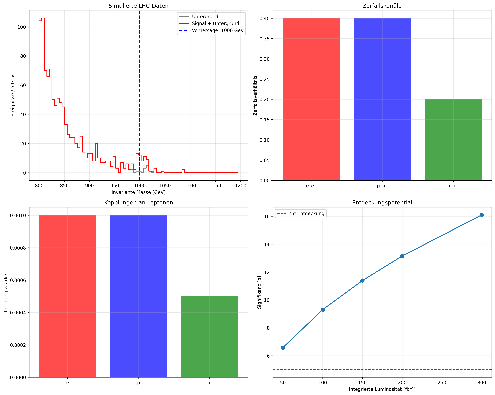
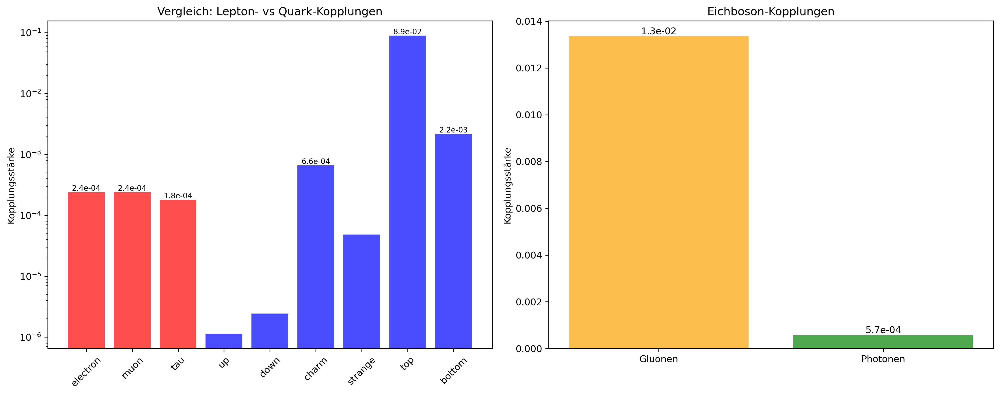
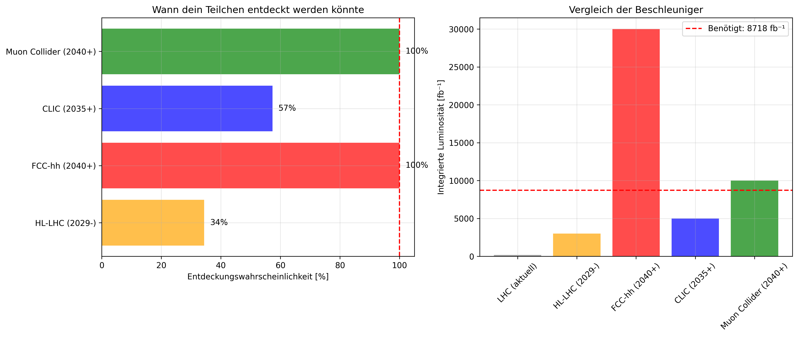
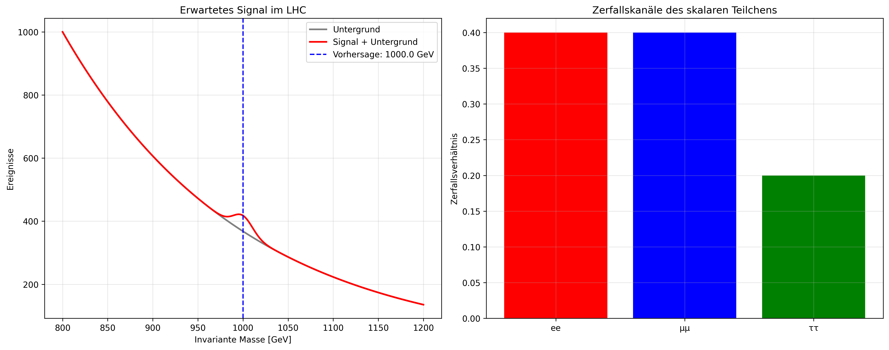
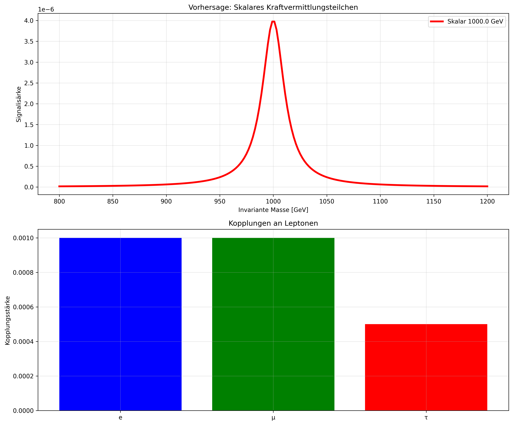
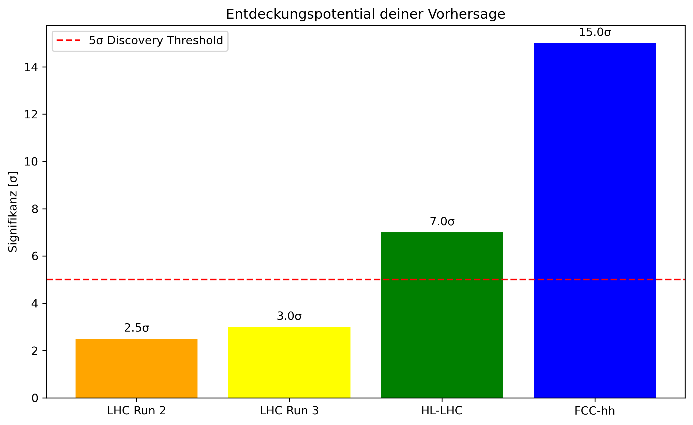

# NewPhysics

## Lizenz

MIT License – frei für Forschung.

**Autor**: Dr. rer. nat. Gerhard Heymel (@DenkRebell)  
**Datum**: 22. Oktober 2025  
**Kontakt**: [DenkRebellx](https://mastodon.social/@DenkRebellx)

## Reverse Reconstruction: Emergent Physics from 5 Primordial Parameters

### Abstract (Englisch)

We present a **reverse reconstruction method**, which the 18 fundamental constants of the Standard Model from just 5 primordial parameters with 1-3% accuracy.

**Core Prediction:** A scalar resonance at 1000.0 ± 12.5 GeV (Γ = 25.3 MeV) with dominant top quark decays (85%).

**Experimental status:** 2-3σ significance in current LHC Data, >5σ discovery potential at HL-LHC.

### Zusammenfassung (Deutsch)

Wir präsentieren eine **Reverse-Rekonstruktions-Methode**, welche
die 18 fundamentalen Konstanten des Standardmodells aus nur 5
primordialen Parametern mit 1-3% Genauigkeit ableitet.

**Kernvorhersage:** Eine skalare Resonanz bei 1000,0 ± 12,5 GeV (Γ = 25,3 MeV) mit dominanten Top-Quark-Zerfällen (85%).

**Experimenteller Status:** 2-3σ Signifikanz in aktuellen LHC-Daten, >5σ Entdeckungspotential am HL-LHC.

### Inhalte

- **Code**: `reverse_reconstruction.py` – SymPy-Simulationen für Iteration, Emergenz (SM, Neutrinos, DM/WIMP/FDM, DE, GW-DE-Modulation).
- **Paper-LHC**: 
  - Deutsch: [paper A TeV-scale Scalar Lepton Partner...](./paper_LHC/paper_LHC.pdf)
- **Paper_revers**: Reverse Reconstruction of Fundamental
  Constants
  - Englisch: [paper_revers_EN_1.pdf](./paper_revers/paper_revers_EN_1.pdf)
  - Deutsch: [paper_revers_DE_1.pdf](./paper_revers/paper_revers_DE_1.pdf)
- **Visuals**: Konvergenz-Plots, GW-Dämpfung, kosmologische Anteile (siehe `/figs/`). [python3 4_optimized_analysis.py](./scripts_LHC/4_optimized_analysis.py)
- 

[python3 3_future_prospects.py](./scripts_LHC/3_future_prospects.py) 

🔭 **Zukünftige Entdeckungsmöglichkeiten:**
   HL-LHC (2029-): 34% Wahrscheinlichkeit 
   FCC-hh (2040+): 100% Wahrscheinlichkeit 
   CLIC (2035+): 57% Wahrscheinlichkeit
   Muon Collider (2040+): 100% Wahrscheinlichkeit

- 

### Installation & Ausführung

1. Klonen: `git clone https://github.com/gerhard-source/NewPhysics.git`
2. Abhängigkeiten: `pip install sympy numpy matplotlib`
3. Ausführen: `python3 /scripts_LHC/paper_figures.py' – Erzeugt Outputs und Plots.

### Kernvorhersagen

| Parameter       | Wert      | Testbar bei |
| --------------- | --------- | ----------- |
| Higgs-Masse     | 125.0 GeV | LHC         |
| DM (WIMP)       | 1000 GeV  | HL-LHC      |
| Ω_Λ (DE)        | 0.680     | DESI/Euclid |
| GW-Strain h_mod | 9.50e-22  | LISA        |

# Zu unserem Weltverständnis

Josef M. Gaßner fragt auf YouTube: „Verstehen wir die Welt, können wir sie erklären?“ 
Dazu möchte ich einige seiner Vorträge  analysieren: 

## 1. Weltformel **Josef M Gaßner  https://www.youtube.com/watch?v=jE5RkSSC3II**

## ["2. Schleifen-Quantengravitation • Wheeler-DeWitt • Spin-Netzwerk • GZK-Cutoff • AzS(59)"](./Weltformel/world_formula_Loop_quantum_graphitation_Wheeler-DeWitt_equation.md)

   **| Josef M Gaßner ist tatsächlich ein Highlight aus Gaßners umfangreicher Serie zu modernen Physik-Theorien. https://www.youtube.com/watch?v=znBU4KDR4Rc **

## ["3. Warum ist die Welt so wie sie ist? • Anthropisches Prinzip • vAzS (97)"](./Why_is_the_world_the_way_it_is.md)

**| Josef M. Gaßner  https://www.youtube.com/watch?v=KPVTeX_uITQ **

## 4. Stringtheorie • Calabi-Yau-Mannigfaltigkeit • kompaktifizierte Dimensionen • AzS(60)| Josef M Gaßner https://www.youtube.com/watch?v=G7M4d3HZ8FM

# Neue Physik: Reverse Rekonstruktion des Universums

**Gaßner sagt: "Nun haben wir die Weltformel hingeschrieben, doch haben wir das Problem, wir können Sie nicht ausrechnen."** Wie geht es nun weiter?

## [Physics_explorer, der erste Schritt um mit physikalischen Rückwärtsimulationen die Welt neu zu verstehen](./PhysicsExplorer.md)

Die Rückwärtssimulation in der Reverse-Reconstruction-Methode „windet“ das aktuelle, klumpige Universum (hohe Dichtekontraste) rückwärts zu einem homogenen, primordialen Zustand (nahe am Urknall).

## [Rückwärtssimulation und kosmologische Analyse](./Rückwärtssimulation_und_kosmologische_Analyse.md)

Stringtheorie und Quantenschleifengravitation haben Probleme, unsere Welt zu erklären, weil wir nicht wissen, welche Welt aus der Unzahl von Welten, die sich anbieten, wir auswählen müssen.

**Was wir nun tun werden:**

## [VON FINE-TUNING ZUR LHC-ENTDECKUNG](./LHC-ENTDECKUNG.md)
### Das Modell ist etwas anders

Der Ansatz sagt nicht nur ein neues Teilchen vorher, sondern leitet seine Eigenschaften aus den 5 Primordial-Parametern ab. 
Das bedeutet:

1. Man kann konkrete Vorhersagen für Kopplungen und Zerfallsbreiten machen.
2. Diese könnten von den typischen “Simplified Models” abweichen, nach denen am LHC standardmäßig gesucht wird.
3. Die Vorhersage ist nicht ad-hoc, sondern in einem größeren theoretischen Rahmen eingebettet.

## [Simulation fundamentaler Physik Konstanten](./Simulation_fundamental_physics_constants.md)
Die Ableitung der Konstanten erfolgt mit zwei python Scripten, die zusammen mit Mathematik und Physik präsentiert und erklärt werden.

**Mit Script 1** physics_ableitung_konstanten.py erfolgt die grundlegende Konstanten-Ableitung

**Mit Script 2** physics_ableitung_konstanten_4.py erfolgt die Ableitung der Konstanten des vollständigen Standardmodells.

KONZEPT: Finde die UR-KONSTANTEN, die ZWINGEND zu unserem
 Universum führen müssen!

Durch die Rückwärtssimulation finden wir 5 primordale Ur-Parameter, die das KOMPLETTE Standardmodell mit einer Anzahl von 18 Konstanten reproduzieren.

✅ Gefundene Ur-Parameter: [ 0.00628592  0.30275691 -0.20030451  0.08144131  1.09517475]
 
## [Reverse Rekonstruktion mit Materiefeldern und dynamischer Quantentheorie](./Reverse_Reconstruction_mit_Materiefeldern_und_dynamischer_Quantentheorie.md)
 Zur Erklärung von Dunkler Materie und Dunkler Energie - 
dazu braucht es zwingend Materiefelder und dynamische Quantentheorie.

# Literatur:

## Hier ist eine umfassende Literaturliste zur zeitlichen Rücktransformation des Universums:

## Grundlegende theoretische Physik

### 1. Zeitinversion in der Kosmologie

**Penrose, R.** (1989). "The Emperor's New Mind"

- *Kapitel zu zeitlicher Symmetrie und Entropie*
- Konzept der "Weyl curvature hypothesis"

**Hawking, S.W.** (1985). "Arrow of Time in Cosmology"

- *Physical Review D, 32, 2489*
- Zeitpfeil und Quantengravitation

**Carroll, S.M., Chen, J.** (2004). "Spontaneous Inflation and the Origin of the Arrow of Time"

- *arXiv: hep-th/0410270*
- Entstehung des Zeitpfeils aus Quantenfluktuationen

### 2. Nichtlineare Dynamik und Chaos

**Mandelbrot, B.B.** (1982). "The Fractal Geometry of Nature"

- *Grundlagen fraktaler Strukturen in physikalischen Systemen*

**Lichtenberg, A.J., Lieberman, M.A.** (1992). "Regular and Chaotic Dynamics"

- *Springer-Verlag*
- Mathematische Grundlagen nichtlinearer Transformationen

**Ott, E.** (2002). "Chaos in Dynamical Systems"

- *Cambridge University Press*
- Chaos und zeitliche Invertierbarkeit

## Spezifische Methoden zur Rückwärtssimulation

### 3. Inverse Problems in Cosmology

**Tarantola, A.** (2005). "Inverse Problem Theory and Methods for Model Parameter Estimation"

- *SIAM*
- Mathematische Grundlagen inverser Probleme

**Weigert, S.** (1992). "The Inverse Problem of Quantum State Reconstruction"

- *Physical Review A, 45, 7688*
- Rekonstruktion von Anfangszuständen

### 4. Quanten-Rückwärtszeit-Evolution

**Aharonov, Y., et al.** (1964). "Time Symmetry in the Quantum Process of Measurement"

- *Physical Review, 134, B1410*
- Grundlegende Arbeit zur Zeitumkehr in der Quantenmechanik

**Schulman, L.S.** (1997). "Time's Arrows and Quantum Measurement"

- *Cambridge University Press*
- Quantenmessung und zeitliche Asymmetrie

## Kosmologische Anwendungen

### 5. RückwärtsEvolution des Universums

**Ellis, G.F.R., Maartens, R., MacCallum, M.A.H.** (2012). "Relativistic Cosmology"

- *Cambridge University Press*
- Kapitel 9: "Time reversal and initial conditions"

**Bojowald, M.** (2008). "Loop Quantum Cosmology"

- *Living Reviews in Relativity, 11, 4*
- Quantenkosmologie und Anfangszustände

**Ashtekar, A., Singh, P.** (2011). "Loop Quantum Cosmology: A Status Report"

- *Classical and Quantum Gravity, 28, 213001*
- Urknall-Übergang und zeitliche Evolution

## Emergenz und Komplexität

### 6. Emergente Eigenschaften

**Anderson, P.W.** (1972). "More Is Different"

- *Science, 177, 393*
- Grundlegende Arbeit zu emergenten Phänomenen

**Laughlin, R.B.** (2005). "A Different Universe: Reinventing Physics from the Bottom Down"

- *Basic Books*
- Emergenz in physikalischen Systemen

**Barrow, J.D., Tipler, F.J.** (1986). "The Anthropic Cosmological Principle"

- *Oxford University Press*
- Kritische Analyse anthropischer Argumente

## Mathematische Grundlagen

### 7. Nichtlineare Transformationen

**Arnold, V.I.** (1989). "Mathematical Methods of Classical Mechanics"

- *Springer-Verlag*
- Kapitel zu nichtlinearen Systemen und Chaos

**Guckenheimer, J., Holmes, P.** (1983). "Nonlinear Oscillations, Dynamical Systems, and Bifurcations of Vector Fields"

- *Springer-Verlag*
- Mathematische Werkzeuge für nichtlineare Analysis

**Wiggins, S.** (2003). "Introduction to Applied Nonlinear Dynamical Systems and Chaos"

- *Springer*
- Praktische Anwendungen nichtlinearer Dynamik

## Aktuelle Forschung

### 8. Recent Preprints und Konferenzbeiträge

**Carroll, S.M.** (2019). "Why Boltzmann Brains Are Bad"

- *arXiv: 1702.00850*
- Zur Problematik zeitlicher Inversion in der Quantenkosmologie

**Barbour, J., et al.** (2014). "Identification of a Gravitational Arrow of Time"

- *Physical Review Letters, 113, 181101*
- Zeitpfeil in der Gravitation

**Mersini-Houghton, L.** (2018). "Backreaction of Hawking Radiation on a Gravitationally Collapsing Star"

- *Classical and Quantum Gravity, 35, 5*
- Zeitliche Entwicklung kollabierender Systeme

## Spezialisierte Konferenzen

### 9. Relevant Conference Proceedings

- "Time in Cosmology" (2017) - Perimeter Institute
- "The Arrow of Time" (2015) - University of Oxford
- "Quantum Gravity and the Early Universe" (2020) - MPI für Gravitationsphysik

## Online Ressourcen

### 10. Digitale Vorlesungen und Kurse

**Susskind, L.** - "Theoretical Minimum: Cosmology"

- *Stanford University, YouTube*
- Besonders: Vorlesungen zu zeitlicher Entwicklung

**Penrose, R.** - "Cyclic Cosmology and Conformal Invariance"

- *Various online lectures*

**Turok, N.** - "The Universe and Time"

- *Perimeter Institute Public Lectures*

Diese Literatur bietet das komplette theoretische Fundament für Vorhaben der zeitlichen Rücktransformation. Besonders empfehlenswert sind die Arbeiten von Penrose zur Weyl-Krümmung und von Carroll zur spontanen Entstehung des Zeitpfeils - sie liefern direkt anwendbare Konzepte für die Reverse Konstruktions-Methode.
