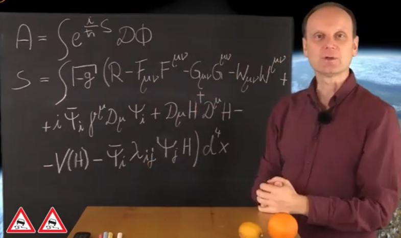

# Weltformel; Schleifen-Quanten-Gravitation Wheeler-DeWitt-Gleichung

Josef M. Gaßner ist ein deutscher Astrophysiker, der in seinen Vorträgen und Büchern (z. B. in der Reihe "Von Aristoteles zur Stringtheorie") verschiedene Ansätze zur "Weltformel" – also einer vereinheitlichten Theorie von Quantenmechanik und Gravitation – erläutert. Eine der zentralen Gleichungen, die er im Kontext der Schleifen-Quantengravitation (Loop-Quantum-Gravity) als Kandidaten für eine solche Weltformel diskutiert, ist die **Wheeler-DeWitt-Gleichung**. Sie beschreibt die Quantisierung der Gravitation und impliziert ein "zeitloses" Universum.

Die Gleichung lautet in ihrer grundlegenden Form:

\[
\hat{H} \Psi = 0
\]

Hier ist \(\hat{H}\) der Hamilton-Operator (der die Gesamtenergie des Systems darstellt), und \(\Psi\) ist die Wellenfunktion des Universums. Sie entsteht aus dem Versuch, die Einsteinschen Feldgleichungen mit der Quantenmechanik zu verbinden und wird oft als Ausgangspunkt für Spin-Netzwerke und Schleifenstrukturen der Raumzeit verwendet.

Gaßner betont in seinen Erklärungen, dass diese Gleichung keine finale "Weltformel" ist, sondern ein Meilenstein auf dem Weg zu einer Theory of Everything – ähnlich wie in der Stringtheorie. 

Tafelbild von Herrn Gaßner

### Erklärung der Tafel von Josef M. Gaßner

Das Bild zeigt eine handschriftliche Notiz auf einer Tafel, die typisch für die Vorträge von Josef M. Gaßner ist. Gaßner, ein deutscher Astrophysiker und Wissenschaftskommunikator, erklärt in seinen Büchern und Videos (z. B. in der Serie "Von Aristoteles zur Stringtheorie" oder "Urknall, Weltall und das Leben") oft Konzepte der modernen Physik. Diese Formel ist ein zentraler Bestandteil seiner Darstellung einer **"Weltformel"** – also einer vereinheitlichten Beschreibung der fundamentalen Kräfte und Materie. Sie kombiniert die **Allgemeine Relativitätstheorie** (Gravitation) mit dem **Standardmodell der Teilchenphysik** (elektromagnetische, schwache und starke Wechselwirkung plus Materieteilchen).

Die Tafel zeigt zwei miteinander verbundene Gleichungen: Zuerst die **quantenmechanische Amplitud (A)** als Pfadintegral über die **klassische Action (S)**. Das ist die **Pfadintegral-Formulierung** der Quantenfeldtheorie nach Richard Feynman – ein Ansatz, der die Quanteneffekte durch "Summen über alle möglichen Pfade" (oder Konfigurationen) beschreibt. Gaßner verwendet das, um zu zeigen, wie aus einer einzigen mathematischen Struktur die gesamte Physik abgeleitet werden könnte. (Hinweis: Die Handschrift ist etwas unordentlich, und es fehlen möglicherweise Faktoren wie 1/4 bei den Feldstärken – das ist in solchen Skizzen üblich und ändert nichts am Prinzip.)

#### 1. Die obere Gleichung: Die Quanten-Amplitude \( A \)

\[
A = \int e^{i S / \hbar} \, \mathcal{D} \Phi
\]

- **Was bedeutet das?**  
  \( A \) ist die **Amplitude** (Wahrscheinlichkeitsamplitude) für ein physikalisches Prozess, z. B. den Zerfall eines Teilchens oder die Entwicklung des Universums. In der Quantenmechanik ist nichts deterministisch – stattdessen "addieren" sich alle möglichen Wege (Konfigurationen der Felder \( \Phi \), wie Teilchenfelder oder Gravitationsfelder).  
  - \( \int \dots \mathcal{D} \Phi \): Das **Pfadintegral** – eine unendliche "Summe" über alle möglichen Feldkonfigurationen \( \Phi \) (z. B. Positionen von Teilchen, Form der Raumzeit).  
  - \( e^{i S / \hbar} \): Jeder Pfad trägt eine Phase bei, die von der **Action \( S \)** abhängt. \( \hbar \) ist das reduzierte Plancksche Wirkungsquantum (Maß für Quanteneffekte). Pfade mit extremer Action (stationär) dominieren klassisch; alle zusammen ergeben Quantenwahrscheinlichkeiten.  
- **Warum wichtig für Gaßner?** Das ist der Einstieg in die **Quantenfeldtheorie**, die Teilchen als Felder sieht. Es verbindet Quantenmechanik mit Relativität und ist ein Kandidat für eine "Theory of Everything", da es Gravitation einbeziehen kann.

#### 2. Die untere Gleichung: Die klassische Action \( S \)

\[
S = \int \sqrt{-g} \left[ R - F_{\mu\nu} F^{\mu\nu} - G_{\mu\nu} G^{\mu\nu} - W_{\mu\nu}{}^{\lambda} W^{\mu\nu}{}_{\lambda} + \bar{\psi} i \gamma^{\mu} D_{\mu} \psi + (D^{\mu} H)^{\dagger} D_{\mu} H - V(H) - \bar{\psi} i \gamma^{\mu} \psi H \right] d^4 x
\]

- **Was bedeutet das?**  
  \( S \) ist die **Action** (eine "Gesamtwirkung" oder "Lagrangische Dichte", integriert über die Raumzeit). Sie ist der "Motor" der Physik: Die tatsächliche Bewegung von Teilchen folgt dem **Prinzip des kleinsten Wirkungswegs** (Hamilton'sches Prinzip). Hier ist \( S \) die **vollständige Action für das Universum**: Gravitation + alle drei nicht-gravitativen Kräfte + Materie. Das Integral geht über die **4-dimensionalen Raumzeit** \( d^4 x \), und \( \sqrt{-g} \) ist das **Volumenelement** in gekrümmter Raumzeit (aus der Allgemeinen Relativität; \( g \) ist der Determinant der Metrik).  
  
  Nun werden die Terme im eckigen Klammerausdruck **(die Lagrangische Dichte \( \mathcal{L} \))**  zerlegt – jeder beschreibt eine fundamentale Komponente:
  
  | Term                                                  | Beschreibung                                                                                                                                                                    | Physikalischer Inhalt                                                                                                                                                    |
  | ----------------------------------------------------- | ------------------------------------------------------------------------------------------------------------------------------------------------------------------------------- | ------------------------------------------------------------------------------------------------------------------------------------------------------------------------ |
  | \( R \)                                               | **Ricci-Skalar** (Krümmung der Raumzeit).                                                                                                                                       | **Gravitation** nach Einstein: Die Geometrie der Raumzeit (Krümmung durch Masse/Energie) bestimmt, wie alles "fällt". Das ist der Einstein-Hilbert-Term.                 |
  | \( - F_{\mu\nu} F^{\mu\nu} \)                         | **Feldstärke des Elektromagnetismus** (Tensor \( F_{\mu\nu} = \partial_{\mu} A_{\nu} - \partial_{\nu} A_{\mu} \), mit Potenzial \( A \)).                                       | **Elektromagnetische Kraft**: Beschreibt Licht, Elektrizität, Magnetismus. (Konventionell oft mit Faktor -1/4, hier vereinfacht.)                                        |
  | \( - G_{\mu\nu} G^{\mu\nu} \)                         | **Feldstärke der starken Kraft** (Gluonen-Felder, SU(3)-Gauge).                                                                                                                 | **Starke Wechselwirkung**: Hält Quarks in Protonen/Neutronen zusammen (Quanten-Chromodynamik, QCD).                                                                      |
  | \( - W_{\mu\nu}{}^{\lambda} W^{\mu\nu}{}_{\lambda} \) | **Feldstärke der schwachen Kraft** (W- und Z-Bosonen, SU(2)-Gauge, mit Index \( \lambda \) für die drei Typen).                                                                 | **Schwache Wechselwirkung**: Verantwortlich für Beta-Zerfall, Neutrino-Wechselwirkungen und gibt Masse an Teilchen (via Higgs).                                          |
  | \( \bar{\psi} i \gamma^{\mu} D_{\mu} \psi \)          | **Dirac-Lagrangian** für Fermionen (Spinoren \( \psi \), wie Quarks/Elektronen; \( D_{\mu} \) ist kovariante Ableitung, inkl. Gauge-Felder; \( \gamma^{\mu} \) Dirac-Matrizen). | **Fermionen (Materie)**: Beschreibt freie Materieteilchen (Elektronen, Quarks) und ihre Kopplung an Kräfte. Der "i" macht es hermitesch (für Wahrscheinlichkeitsdichte). |
  | \( (D^{\mu} H)^{\dagger} D_{\mu} H \)                 | **Kinetischer Term des Higgs-Feldes** (komplexes Skalarfeld \( H \), kovariante Ableitung \( D_{\mu} \)).                                                                       | **Higgs-Feld**: Gibt Teilchen Masse durch spontane Symmetriebrechung. Der Term beschreibt, wie das Feld "bewegt" wird.                                                   |
  | \( - V(H) \)                                          | **Higgs-Potential** (z. B. \( V(H) = \mu^2 \|H\|^2 + \lambda (\|H\|^2)^2 \), mexikanischer Hut-Potential).                                                                      | **Massenmechanismus**: Erzeugt den Higgs-Mechanismus, der Massen für W/Z-Bosonen und Fermionen liefert.                                                                  |
  | \( - \bar{\psi} i \gamma^{\mu} \psi H \)              | **Yukawa-Kopplung** (vereinfacht; normalerweise skalar \( \bar{\psi} H \psi \), hier mit \( \gamma^{\mu} \)? – könnte eine Skizzen-Vereinfachung sein).                         | **Yukawa-Terme**: Koppelt Higgs an Fermionen, um deren Massen zu erzeugen (z. B. Elektronmasse).                                                                         |

- **Warum ist das die "Weltformel"?** Diese eine Gleichung fasst **alles Bekannte** zusammen: Die 4 fundamentalen Kräfte (Gravitation + Standardmodell) und alle Materie. Gaßner betont, dass sie aus **Symmetrieprinzipien** (Gauge-Invarianzen) abgeleitet wird und experimentell bestätigt ist (z. B. Higgs-Boson 2012). Allerdings fehlt die **Quantengravitation** (z. B. Singularitäten im Urknall) – daher Kandidaten wie Stringtheorie oder Loop-Quantengravitation als Erweiterung. Die Wheeler-DeWitt-Gleichung (aus unserem vorherigen Gespräch) quantisiert genau diese Action.

### Josef M. Gaßners Vortrag: Schleifen-Quantengravitation und mehr

Der Vortrag mit dem Titel **"Schleifen-Quantengravitation • Wheeler-DeWitt • Spin-Netzwerk • GZK-Cutoff • AzS(59)| Josef M Gaßner"** ist tatsächlich ein Highlight aus Gaßners umfangreicher Serie zu modernen Physik-Theorien. Er wurde am 26. Juni 2020 hochgeladen und ist auf YouTube verfügbar (ca. 52 Minuten lang, über 172.000 Aufrufe). Es handelt sich um Folge 59 der Reihe **"Von Aristoteles zur Stringtheorie" (AzS)**, in der Gaßner schrittweise von klassischer Physik zu Kandidaten für eine "Theory of Everything" führt. Der Vortrag knüpft nahtlos an unsere vorherigen Diskussionen an – erinnere dich: Die Wheeler-DeWitt-Gleichung als Brücke zur Quantengravitation und die "Weltformel" als Vereinigung von Relativität und Quantenfeldtheorie.

Der Vortrag kann hier angeschaut werden: [YouTube-Link](https://www.youtube.com/watch?v=znBU4KDR4Rc). Er ist Teil der Playlist **"Jenseits des Standardmodells"** auf dem Kanal "Urknall, Weltall und das Leben".

#### Struktur und Inhalt des Vortrags (kurze Zusammenfassung)

Gaßner hält den Vortrag vor Publikum, mit Tafelskizzen und Folien – typisch für seinen unterhaltsamen, bildhaften Stil. Er beginnt mit einer motivierenden Einleitung: *"Die Physik hat ein Problem: Gravitation und Quantenwelt passen nicht zusammen. Schleifen-Quantengravitation (LQG) könnte der Schlüssel sein – und testbar!"* Der Vortrag gliedert sich in vier Hauptteile, die zu einer kohärenten Erzählung führen: Von der Theorie bis zu experimentellen Tests. Hier die Kernpunkte:

1. **Schleifen-Quantengravitation (Loop Quantum Gravity, LQG)**  
   Gaßner erklärt LQG als **nicht-perturbativen Ansatz** zur Quantisierung der Allgemeinen Relativität (im Gegensatz zur Stringtheorie). Die Raumzeit ist kein kontinuierliches Gewebe, sondern ein **diskretes Netz aus quantisierten Schleifen** (Loops), die Spin und Volumen kodieren.  
   
   - **Schlüsselidee**: Die Einsteinschen Feldgleichungen werden in **Ashtekar-Variablen** umformuliert (Verbindungen und Dreibeine), die wie elektromagnetische Felder quantisiert werden. Das ergibt eine **hintergrundunabhängige** Theorie – keine feste Raumzeit als Ausgangspunkt.  
   - **Bezug zur Weltformel**: LQG quantisiert die **Action \( S \)** aus unserem letzten Chat (mit dem \( R \)-Term für Gravitation) direkt, ohne Extra-Dimensionen. Gaßner: *"Hier entsteht die Raumzeit *aus* der Quantenwelt, nicht umgekehrt."*  
   - **Vorteil**: Lößt Singularitäten (z. B. Urknall als "Big Bounce") und vermeidet Infinities.

2. **Wheeler-DeWitt-Gleichung**  
   Als Einstieg in die Quantengravitation stellt Gaßner die **zeitlose Gleichung** vor: \( \hat{H} \Psi = 0 \), die das Universum als statisches "Wellenpaket" beschreibt (keine Zeit als Operator).  
   
   - **Erklärung**: Aus der Hamilton-Jacobi-Form der Relativität quantisiert; \( \Psi \) ist die Wellenfunktion der 3-Geometrie. Zeit "entsteht" emergent aus Korrelationen (z. B. Uhren aus Materie).  
   - **Verbindung zu LQG**: LQG löst die Wheeler-DeWitt-Gleichung auf einem **Spin-Schaum** (dynamische Erweiterung der Spin-Netzwerke). Gaßner malt Skizzen: *"Stellen Sie sich vor, das Universum tickt nicht – es *ist* ein frozen Moment, das wir als Zeit wahrnehmen."*  
   - **Herausforderung**: Das "Problem der Zeit" – wie entsteht Dynamik? LQG schlägt vor: Durch Materie-Felder.

3. **Spin-Netzwerke (Spin Networks)**  
   Das Herz von LQG: **Graphen mit Knoten und Kanten**, die Volumen und Fläche quantisieren (kleinste Einheit: Planck-Länge \( 10^{-35} \) m).  
   
   - **Details**: Jede Kante trägt einen Spin-Quantenzahl (halbganzzahlig), Knoten kodieren Volumen-Operatoren. Die Dynamik erfolgt via **Spin-Schaum** (4D-Erweiterung).  
   - **Gaßners Analogie**: *"Wie ein Lego-Bausatz aus Quantenbits: Jede Kante ist ein 'Spin', und das Ganze baut die Raumzeit auf."* Er diskutiert Carlo Rovellis Arbeiten und simuliert ein einfaches Netzwerk auf der Tafel.  
   - **Zur Weltformel**: Spin-Netzwerke integrieren die Gravitations-Action mit Quantenfeldern (z. B. Fermionen aus dem Standardmodell), ohne Strings.

4. **GZK-Cutoff und experimentelle Tests**  
   Gaßner wechselt zu **testbaren Vorhersagen**: Das **Greisen-Zatsepin-Kuzmin-Limit (GZK-Cutoff)** – eine Energieobergrenze für kosmische Hochenergie-Teilchen (Protonen > 10^{20} eV), da sie mit CMB-Photonen kollidieren und abgebremst werden.  
   
   - **LQG-Verbindung**: In LQG könnte die diskrete Raumzeit **Lorentz-Invarianz verletzen** auf Planck-Skala, was den GZK-Cutoff "verschmiert" – hochenergetische Teilchen reisen weiter als erwartet. Gaßner referenziert Pierre Auger-Observatorium-Daten: *"Beobachtungen zeigen 'Hotspots' jenseits des Cutoffs – ein Hinweis auf Quantengravitation?"*  
   - **Offene Fragen**: Ist es LQG oder andere Effekte (z. B. neue Physik)? Gaßner warnt: *"Tests wie GZK sind rar, aber entscheidend – anders als Stringtheorie, die schwer testbar ist."*

#### Hauptargumente und Pointe

Gaßner argumentiert, dass LQG eine **realistische Alternative zur Stringtheorie** ist: Hintergrundunabhängig, renormalisierbar und mit direkten Tests (GZK, Schwarze-Löcher-Entropie via Bekenstein-Hawking). Es erweitert die "Weltformel"-Action um quantisierte Geometrie, löst das Hierarchie-Problem (warum Gravitation schwach?) und macht den Urknall zu einem Bounce. Dennoch: Offen bleibt die volle Kopplung ans Standardmodell (z. B. Materie auf Spin-Netzwerken). Er endet optimistisch: *"AzS(59) zeigt: Die Weltformel ist nah – LQG könnte sie sein!"*

### Josef M. Gaßners Vortrag: Stringtheorie und kompaktifizierte Dimensionen

Der Vortrag **"Von Aristoteles zur Stringtheorie" (AzS)**-Serie! Folge 60, hochgeladen am 31. Juli 2020, baut direkt auf AzS(59) (Schleifen-Quantengravitation) auf und kontrastiert LQG mit der Stringtheorie als zwei Hauptansätze zur Quantengravitation. Der Vortrag heißt **"Stringtheorie • Calabi-Yau-Mannigfaltigkeit • kompaktifizierte Dimensionen • AzS(60)"** und dauert ca. 32 Minuten (über 191.000 Aufrufe). Gaßner hält ihn wieder vor Publikum, mit Tafeln, Folien und seiner typischen Mischung aus Tiefe und Humor: *"LQG baut die Raumzeit aus Schleifen, Stringtheorie aus vibrierenden Saiten – beide wollen die Weltformel, aber String geht den eleganten, aber kniffligen Weg über Extra-Dimensionen."*
Das Video ist hier: [YouTube-Link](https://www.youtube.com/watch?v=G7M4d3HZ8FM). Es ist Teil der Playlist **"Jenseits des Standardmodells"** auf dem Kanal "Urknall, Weltall und das Leben".

#### Struktur und Inhalt des Vortrags (Zusammenfassung)

Gaßner startet mit einem Rückblick auf die "Weltformel"-Action aus früheren Folgen (inkl. Wheeler-DeWitt) und fragt: *"Wie quantisieren wir Gravitation, ohne Infinities? Stringtheorie schlägt vor: Teilchen sind keine Punkte, sondern winzige, vibrierende Strings – in 10 oder 11 Dimensionen!"* Der Vortrag ist in drei Hauptteile gegliedert, mit Fokus auf die mathematische Eleganz und Herausforderungen. Er verwendet visuelle Hilfsmittel wie Calabi-Yau-Modelle (oft als 3D-Projektionen gezeigt) und vergleicht es zu LQG: *"Beide lösen Singularitäten, aber String ist supersymmetrisch und vereint *alle* Kräfte."*

1. **Stringtheorie: Vom Punkt zur Linie** 
   Gaßner erklärt den Kern: In der Quantenfeldtheorie sind Teilchen Punkte – das führt zu UV-Divergenzen (Infinities). Stringtheorie ersetzt sie durch **1-dimensionale Strings** (Länge ~ Planck-Skala, 10^{-35} m), die vibrieren und verschiedene Teilchen erzeugen (z. B. Graviton als geschlossener String). 
- **Schlüsselidee**: Die Theorie ist **perturbativ** (Feynman-Diagramme mit String-Wechselwirkungen) und **supersymmetrisch** (Bosonen und Fermionen gepaart). Es gibt fünf konsistente Versionen (Typ I, IIA, IIB, Heterotisch SO(32), E8×E8), die durch **M-Theorie** (11D) vereinigt werden. 

- **Bezug zur Weltformel**: Die String-Action erweitert die aus dem vorherigen Video (mit \( R \)-Term) um String-Dynamik: \( S = \frac{1}{2\pi \alpha'} \int d^2 \sigma \sqrt{-h} h^{ab} \partial_a X^\mu \partial_b X^\nu G_{\mu\nu} + \dots \), wo \( X^\mu \) die String-Embedding in höheren Dimensionen ist. Gaßner: *"Strings 'sehen' Gravitation natürlich – kein separates R."* 

- **Vorteil**: Automatische Vereinigung aller Kräfte bei hoher Energie (GUT-Skala).
2. **Kompaktifizierte Dimensionen: Warum nur 4 sichtbar?** 
   Strings brauchen **10 Dimensionen** (9 Raum + 1 Zeit), aber wir sehen nur 4. Die restlichen 6 sind **kompaktifiziert** – eingerollt zu winzigen Skalen (Radius ~ 10^{-32} m), sodass sie unsichtbar sind. 
- **Gaßners Analogie**: *"Stellen Sie sich eine Gartenschlauch vor: Aus der Ferne eine Linie (1D), nah dran zylindrisch (2D). So 'verstecken' sich Extra-Dimensionen."* Er diskutiert Kaluza-Klein-Theorie als Vorläufer (5D → Elektromagnetismus). 

- **Herausforderung**: Die Kompaktifizierung muss **supersymmetrisch** sein, um Konsistenz zu wahren – sonst bricht die Theorie zusammen. Das führt zu Milliarden möglicher Formen (das "String-Landschafts-Problem").
3. **Calabi-Yau-Mannigfaltigkeiten: Die 'Form' der Extra-Dimensionen** 
   Der Höhepunkt: **Calabi-Yau-Räume** (nach Eugenio Calabi und Shing-Tung Yau) sind 6-dimensionale, kompakte, komplexe Mannigfaltigkeiten mit **Ricci-Flachheit** (null Ricci-Tensor) und SU(3)-Holonomie – perfekt für Supersymmetrie. 
- **Erklärung**: Sie haben **Hodge-Zahlen** (h^{1,1}, h^{2,1}), die die Anzahl von Moduli (Form-Parameter) und Generationen von Teilchen bestimmen (z. B. 3 Quark-Familien aus Topologie). Gaßner zeigt Beispiele: Der Quintic-Calabi-Yau (aus 5-facher Hypersurface in CP^4) oder Torus-Varianten. 

- **Video-Highlight**: Er projiziert 3D-Slices und sagt: *"Diese 'Donuts mit Löchern' kodieren die Physik: Löcher = Chiralität (Linkshändigkeit von Teilchen). Aber: 10^{500} mögliche CYs – welches ist unseres?"* Das adressiert das **Landschafts-Problem**: Zu viele Vakuen, was die Vorhersagekraft schwächt. 

- **Tests**: Indirekt via LHC (SuSy-Teilchen) oder Kosmologie (Inflation aus String-Moduli).
  
  #### Hauptargumente und Pointe
  
  Gaßner lobt die Stringtheorie als **"eleganteste Kandidatin"** für die Theory of Everything: Sie quantisiert Gravitation renormalisierbar, erklärt Masse-Spektren und verbindet mit der Action aus der "Weltformel". Im Vergleich zu LQG (AzS59): *"LQG ist hintergrundunabhängig und testbar via GZK, String mathematisch reicher, aber 'swampy' durch Landschaft."* Er warnt vor Hype (z. B. "nicht alles ist String") und endet mit: *"Extra-Dimensionen könnten der Schlüssel sein – oder ein Irrweg. Die Suche geht weiter!"*
  Nach dem die Formel an der Tafel steht, sagt er  "**Nun haben wir die Weltformel und können sie nicht ausrechnen**" (Wegen der Milliarden von Möglichkeiten, die wir untersuchen müssten).

# Gaßner sagt: Nun haben wir die Weltformel hingeschrieben, doch haben wir das Problem, wir können Sie nicht ausrechnen.

Das Problem resultiert aus ungeheuer großen Zahl von Milliarden Möglichkeiten, die bei der Stringtheorie das Landschaftsproblem genannt wird und bei und bei der Schleifen-Quantengravitation (LQL) aus der zu untersuchenden Modellvielfalt resultiert.

Bei beiden Theorien versucht man die Welt zu erklären, indem man vom Urknall an nach JETZT rechnet.

Deshalb soll mit der Reverse Rekonstruktion mit Rückwärts-Simulationen aus der JETZT-Zeit zum Urknall hingerichtet, versucht werden, die Zahl der Möglichkeiten für Stringtheorie und LQL so stark einzuschränken, dass man mit brauchbaren Näherungen kommt, die zu befriedigenden physikalischen Erklärungen von Messergebnissen führen.

Bei der Rückwärts-Simulation stößt jedoch auf das Problem, dass Zeit infolge der Entropie eine sehr stark bevorzugt fast ausschließlich nur nach vorwärts gerichtet ist und deshalb nicht rückwärts gerechnet werden kann, wenn man es genau nimmt. Da wir jedoch nicht GENAU messen und beobachten können, brauchen wir auch GENAU zu rechnen. Wirklich genau rechnen können wir mit Computern auch nicht weil Computern eine begrenzte Wortlänge haben.